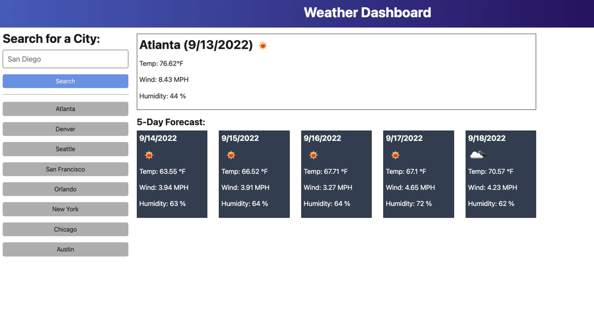

# 09 Servers and APIs: Weather Dashboard

## Your Task

External APIs allow developers to access their data and functionality by making requests with specific parameters to a URL. Developers are often tasked with retrieving data from another application's API and using it in their context, frequently consuming this data via a server.

Your challenge is to build a weather dashboard application that calls the OpenWeather API and renders data in the browser.

The application’s front end has already been created. It's your job to build the back end, connect the two, and then deploy the entire application to Render.

* Use the [5-day weather forecast API](https://openweathermap.org/forecast5) to retrieve weather data for cities.

* The base URL should look like the following:

  ```url
  https://api.openweathermap.org/data/2.5/forecast?lat={lat}&lon={lon}&appid={API key}
  ```

* After registering for a new API key, you may need to wait up to 2 hours for that API key to activate.

* For more information on how to work with the OpenWeather API, refer to the [Full-Stack Blog on how to use API keys](https://coding-boot-camp.github.io/full-stack/apis/how-to-use-api-keys).

## User Story

```md
AS A traveler

I WANT to see the weather outlook for multiple cities

SO THAT I can plan a trip accordingly
```

## Acceptance Criteria

```md
GIVEN a weather dashboard with form inputs

WHEN I search for a city

THEN I am presented with current and future conditions for that city, and that city is added to the search history

WHEN I view current weather conditions for that city

THEN I am presented with the city name, the date, an icon representation of weather conditions, a description of the weather for the icon's alt tag, the temperature, the humidity, and the wind speed

WHEN I view future weather conditions for that city

THEN I am presented with a 5-day forecast that displays the date, an icon representation of weather conditions, the temperature, the wind speed, and the humidity

WHEN I click on a city in the search history

THEN I am again presented with current and future conditions for that city
```

## Mock-Up

The following image shows the web application's appearance and functionality:



## Getting Started

On the back end, the application should include a `searchHistory.json` file that will be used to store and retrieve cities using the `fs` module.

The following HTML route should be created:

* `GET *` should return the `index.html` file.

The following API routes should be created:

* `GET /api/weather/history` should read the `searchHistory.json` file and return all saved cities as JSON.

* `POST /api/weather` should receive a city name to save on the request body, add it to the `searchHistory.json` file, and then return associated weather data to the client. You'll need to find a way to give each city name a unique id when it's saved (look into npm packages that could do this for you).

Refer to the [Full-Stack Blog on deploying to Render](https://coding-boot-camp.github.io/full-stack/render/render-deployment-guide) and the [Render documentation on setting environment variables](https://docs.render.com/configure-environment-variables).

---
© 2024 edX Boot Camps LLC. Confidential and Proprietary. All Rights Reserved.
